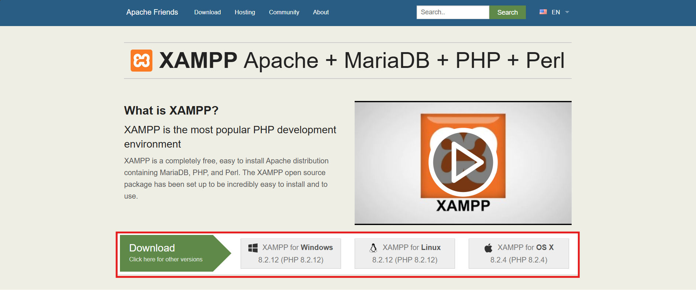
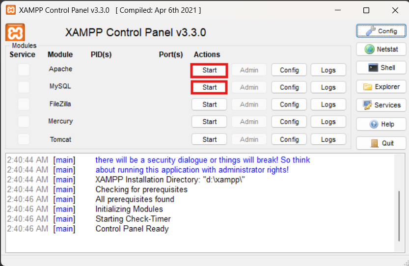
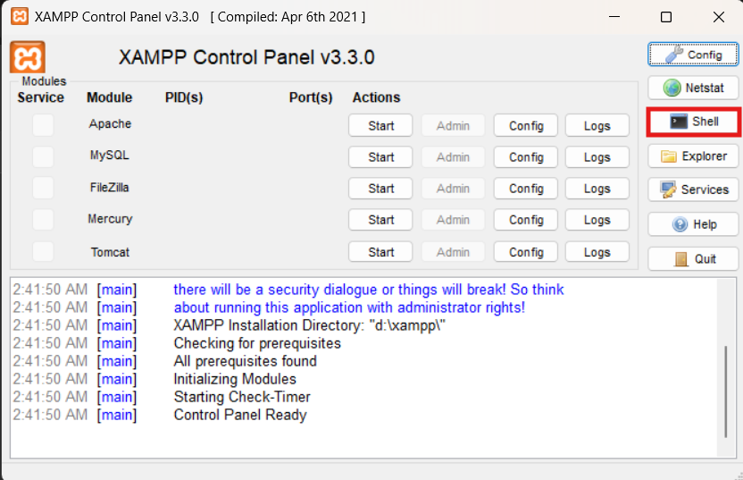

# CSE370 - Database Systems

**Semester:** Fall 2023

## Overview

This repository contains lab assignments for CSE370: Database Systems. The course covers fundamental concepts in database design, implementation, and management. Through a series of hands-on lab assignments, students explore relational database theory, SQL queries, database normalization, and practical database applications.

## Course Information

- **Course Code:** CSE370
- **Course Title:** Database Systems
- **Semester:** Fall 2023
- **Institution:**BRAC University (CSE Department)


## Lab Assignments

### Lab 1: Database Fundamentals
Introduction to database concepts, relational model basics, and SQL queries.
- **Files:** `LabAssignment01.pdf`, `CSE370_Lab_Assignment01_Student_View.pdf`

### Lab 2: Advanced SQL & Database Design
Database design principles, normalization, and complex SQL operations.
- **Files:** `LabAssignment02.pdf`, `CSE370_Lab_Assignment02_Student_View.pdf`

### Lab 3: Bank Database Application
Comprehensive database design and implementation for a banking system.
- **Files:** `LabAssignment03.pdf`, `CSE370_Lab_Assignment03_Student_View.pdf`
- **Data:** `CSE370_Lab03_Assignment03_BankDatabaseData [Student View].pdf`

## Repository Structure

```
CSE370-Database-Systems/
├── README.md                                          # This file
├── LabAssignment01.pdf                               # Lab 1 assignment details
├── LabAssignment02.pdf                               # Lab 2 assignment details
├── LabAssignment03.pdf                               # Lab 3 assignment details
├── CSE370_Lab_Assignment01_Student_View.pdf          # Lab 1 student resources
├── CSE370_Lab_Assignment02_Student_View.pdf          # Lab 2 student resources
├── CSE370_Lab_Assignment03_Student_View.pdf          # Lab 3 student resources
└── CSE370_Lab03_Assignment03_BankDatabaseData.pdf    # Lab 3 sample data
```

## Tools & Technologies

- **DBMS:** (SQL-based relational database)
- **Languages:** SQL
- **XAMPP**

## Installation and Setup Guide

### Setting up XAMPP for Database Development

Follow these steps to set up your local development environment:

#### Step 1: Download XAMPP
1. Go to https://www.apachefriends.org/index.html
2. Download XAMPP for your operating system (Windows, macOS, or Linux)

#### Step 2: Install XAMPP
1. Run the XAMPP installer
2. Follow the installation guide provided by Apache Friends
3. Choose a suitable installation directory

#### Step 3: Start Apache and MySQL Services
1. Open the XAMPP Control Panel after installation
2. Click the **Start** buttons (highlighted in red) next to:
   - **Apache** - Web server
   - **MySQL** - Database server

#### Step 4: Open the MySQL Shell
1. Click on the **Shell** button on the right side of the XAMPP Control Panel window
2. A black command window should open

#### Step 5: Connect to MySQL Server
1. In the shell window, type the following command:
   ```bash
   mysql -u root -p
   ```
2. When prompted for a password, simply press **Enter** (the default XAMPP password is empty)
3. You should now be connected to the MySQL server

##
**Note:** You are now ready to create databases and run SQL queries for the lab assignments.

## Course Project

In addition to the lab assignments, a comprehensive course project was developed:

### Blood Bank Management System
A full-featured database application for managing blood bank operations, including donor management, blood inventory tracking, and request handling.

**Repository:** [Blood-Bank-Management-System](https://github.com/ShafiurShuvo/Blood-Bank-Management-System)

This project applies the database concepts learned throughout the course to a real-world web application.

*This repository contains course materials and assignments for educational purposes.*
